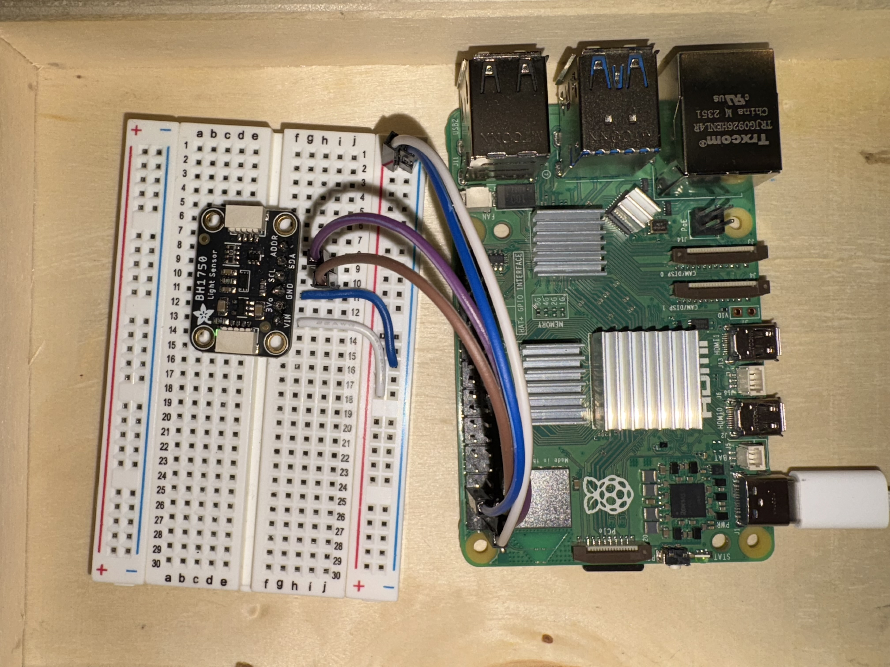

# Light Sensor Module with BH1750

This project uses the BH1750 light sensor module to measure light intensity via I2C communication. The sensor reads light levels and prints the values to the console.

## Dependencies

The following dependencies are required to run this project:

- `smbus2`: Used to communicate with the BH1750 sensor over I2C.

To install the dependencies, run:
```bash
pip install smbus2

```

For Raspberry Pi 5, the BH1750 module is connected as follows:

SDA (Data) -> GPIO 2
SCL (Clock) -> GPIO 3
Make sure to enable I2C on your Raspberry Pi before running the code.

How to Run:

1. Clone the Repository
    git clone https://github.com/your-username/your-repo.git
    cd your-repo

2. Set up a virtual environment (optional but recommended):
    - python3 -m venv venv
    - source venv/bin/activate  # Linux/Mac
    - venv\Scripts\activate     # Windows

3. Install the dependencies:
    ```bash
    pip install smbus2
    ```

4. Run the sensor code:
    ```bash
    light.py
    ```

5. Stop running code:
    ctrl+c OR ctrl+z


Image of Setup:



